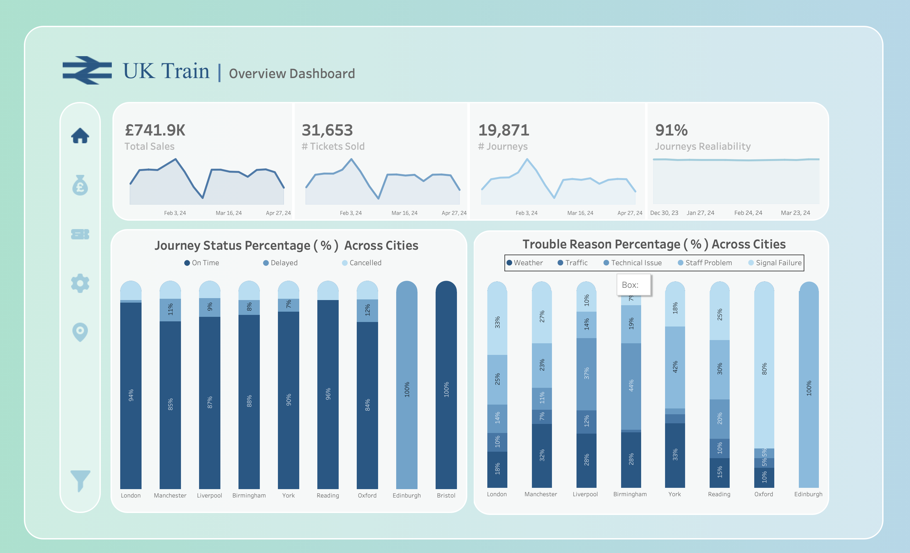
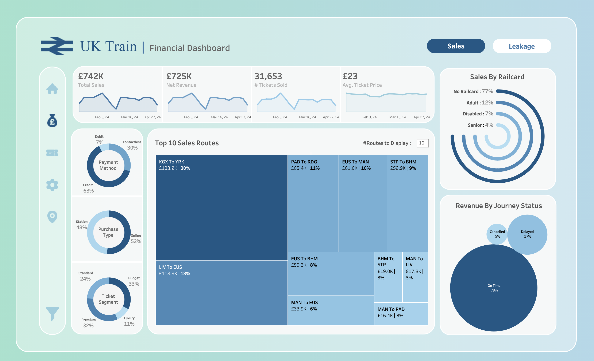
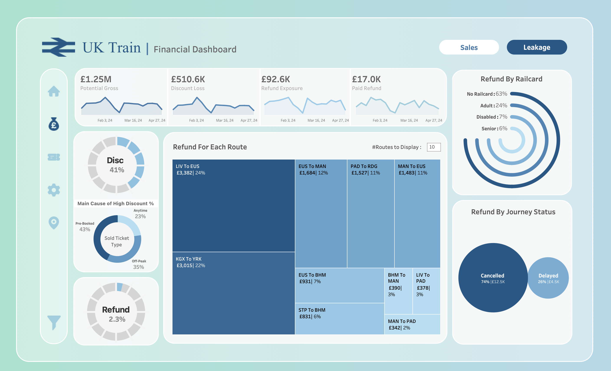
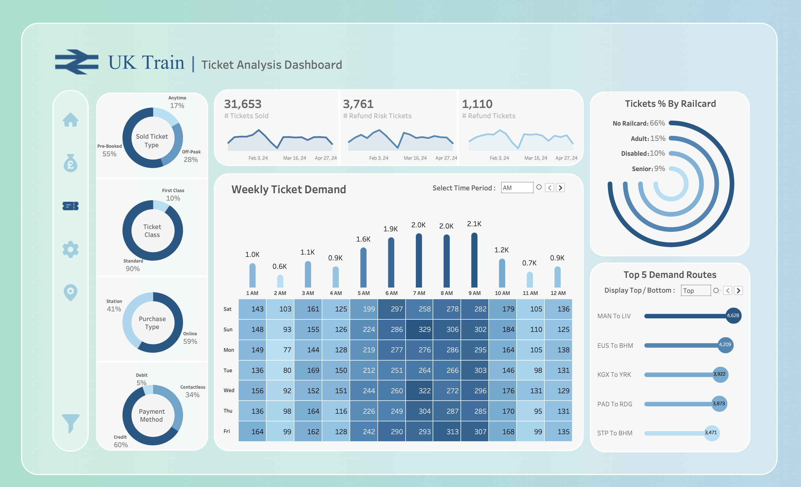
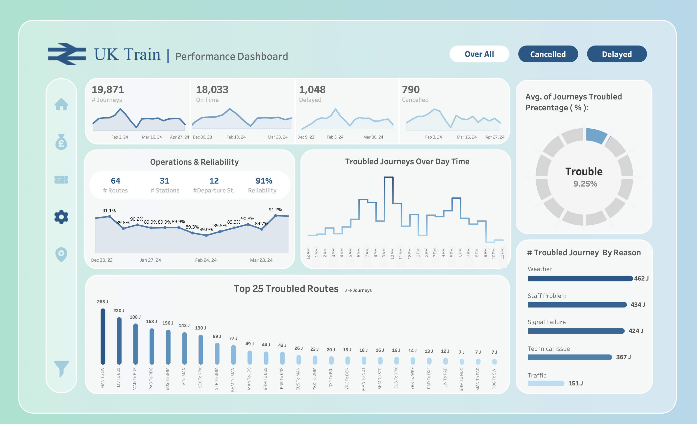
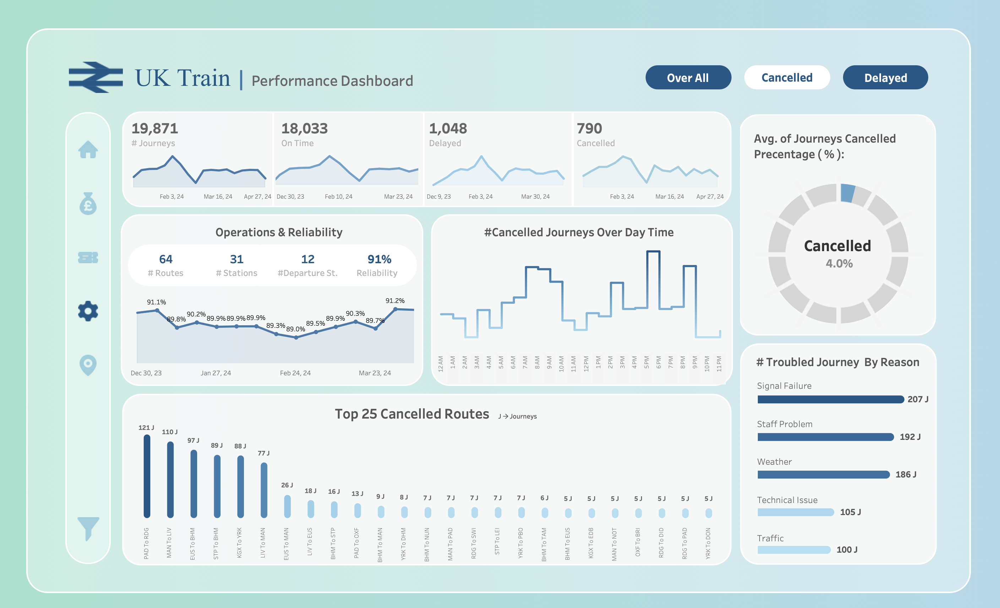
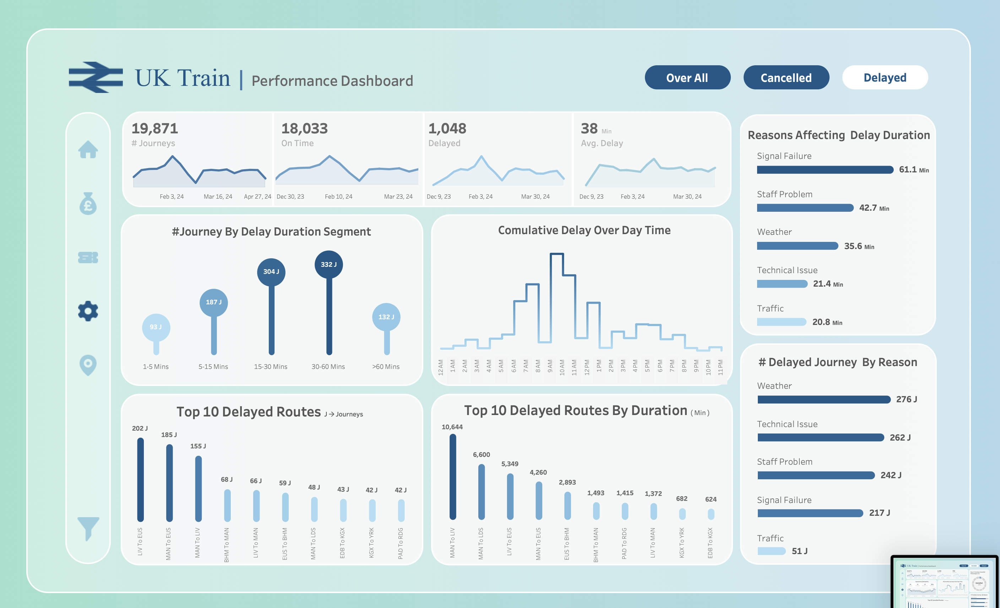
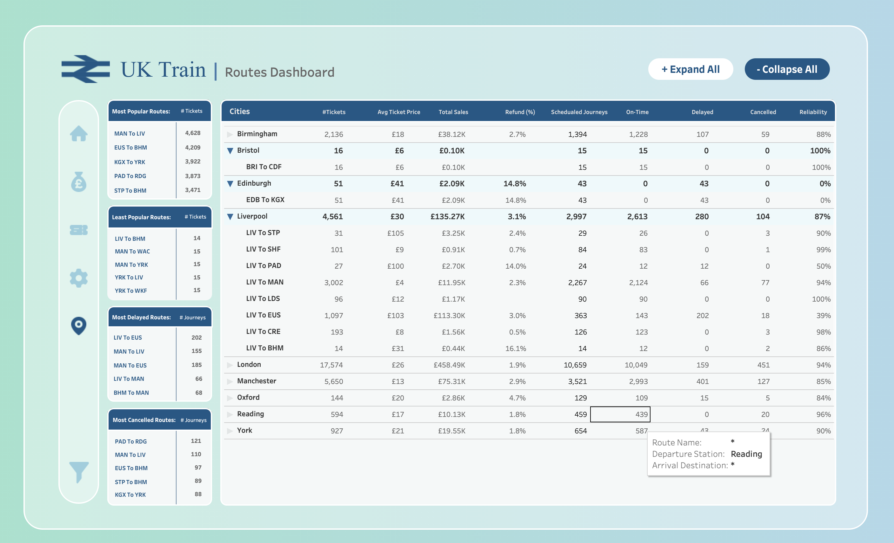

# 🚆 UK Train Comprehensive Data Analysis

> A Graduation Project for the **Digital Egypt Pioneers Initiative (DEPI)**, under the supervision of **iLearn Academy (Round 4)**.

---

## 📖 Project Overview

This project focuses on optimizing network reliability and maximizing financial performance for the UK Train Network through data-driven business intelligence. We transformed **31,653 UK rail transactions** into a validated, business-ready dataset. By combining data engineering, interactive dashboards, and AI-powered predictions, this project supports strategic, data-driven decision-making.

---

## 📑 Table of Contents

- [Strategic Business Questions](#-strategic-business-questions-eda)
- [Data Architecture Strategy](#️-data-architecture-strategy)
- [End-to-End Methodology & ETL](#️-end-to-end-methodology--etl)
- [Visual Intelligence & Dashboards](#-visual-intelligence--dashboards)
- [Screenshots & Preview](#-screenshots--preview)
- [Predictive Analytics & ML Integration](#-predictive-analytics--ml-integration)
- [Strategic Recommendations](#-strategic-recommendations)
- [Meet Our Team](#-meet-our-team)

---

## 🎯 Strategic Business Questions (EDA)

Our Exploratory Data Analysis (EDA) tackles critical questions across key operational and financial areas to drive actionable insights:

| Focus Area | Key Questions |
|---|---|
| **Executive Network Health** | Assess overall passenger volume, sales, and reliability; map the geographic distribution of operational disruptions. |
| **Financial Integrity & Leakage** | Quantify revenue erosion due to refunds, correlate delay reasons with high refund values, and evaluate the impact of the Railcard scheme. |
| **Ticket Dynamics & Profiling** | Compare online vs. station ticket sales, analyze payment methods, and understand Railcard holder traffic patterns. |
| **Operational Efficiency** | Measure on-time performance degradation during peak hours, diagnose systemic delay triggers (weather, technical issues), and analyze weekly SLA non-compliance patterns. |
| **Route Corridor Optimization** | Compare the profitability of different routes and pinpoint saturated operational bottlenecks. |

---

## 🏗️ Data Architecture Strategy

We engineered a cohesive analytical pathway from a national macro-level down to granular operational micro-details, following a structured, multi-layer approach:

| Layer | Description |
|---|---|
| 🥉 **Bronze** | Raw data ingestion via batch processing and full load (truncate & insert), with no transformations. |
| 🥈 **Silver** | Cleaned and standardized data — cleansing, standardization, derived columns, and enrichment. |
| 🔗 **Silver_3NF** | A normalized database (3rd Normal Form) that eliminates redundancy, enforces referential integrity, and enables detailed transactional reconciliation. |
| 🥇 **Gold** | Business-ready data in a Star Schema optimized for aggregation and fast query performance for reporting and analytics. |

---

## ⚙️ End-to-End Methodology & ETL

Each stage of the pipeline is governed by traceable validation gates and cross-tool verification to ensure fidelity:

1. **Data Profiling & Diagnostics** — Discovering structural and quality issues across the data.
2. **Logic Gates** — Identifying and reconciling contradictions between parallel pipelines.
3. **Data Cleaning** — Handling missing values, transforming data types, and normalizing values.
4. **Standardization** — Removing terminology fragmentation and unifying station identifiers.
5. **Cleaning Audit** — Ensuring zero-error logic before production handover.
6. **Production** — Deploying verified datasets for analytical dashboards.

---

## 📊 Visual Intelligence & Dashboards

Our dashboards provide a priority-driven, "app-like" user experience integrating the official UK National Rail identity and color palette. Built with **Tableau Public** and **Power BI**.

🔗 **Live Tableau Dashboard:** [UK Train Dashboard – Financial & Sales](https://public.tableau.com/views/UKTrainDashboardF/FinancialSales?:language=en-GB&publish=yes&:sid=&:redirect=auth&:display_count=n&:origin=viz_share_link)

| Dashboard | Description |
|---|---|
| **Overview** | High-level interactive analytics covering sales, tickets sold, and journey reliability. |
| **Financial** | Tracks potential gross, discount loss, refund exposure, and net revenue. |
| **Tickets** | Analyzes weekly ticket demand, ticket classes, purchase types, and top demand routes. |
| **Performance** | Details operational efficiency, tracking cancelled/delayed routes and primary delay causes. |
| **Routes** | Provides logistics and performance metrics for individual city-to-city train routes. |

---

## 🖼️ Screenshots & Preview

> Add your dashboard screenshots below. Upload the images to a folder (e.g. `assets/screenshots/`) in the repo, then reference them with the paths shown.

<table>
  <tr>
    <td align="center">
      
       <b>Overview Dashboard</b>
    </td>
    <td align="center">
      
       <b>Sales Dashboard</b>
    </td>
  </tr>
  <tr>
    <td align="center">
      
       <b>Leakage Dashboard</b>
    </td>
    <td align="center">
      
       <b>Tickets Dashboard</b>
    </td>
  </tr>
  <tr>
    <td align="center">
      
       <b>Performance Dashboard</b>
    </td>
    <td align="center">
      
       <b>Cancelled Dashboard</b>
    </td>
  </tr>
  <tr>
    <td align="center">
      
       <b>Delayed Dashboard</b>
    </td>
    <td align="center">
      
       <b>Routes Dashboard</b>
    </td>
  </tr>
</table>

<!--
Tip: to add a new screenshot —
1. Save the image inside assets/screenshots/ in your repo
2. Add a row/cell above pointing to it, e.g.:
   
-->

---

## 🤖 Predictive Analytics & ML Integration

To shift from reactive reporting to real-time foresight, we integrated Machine Learning and AI capabilities:

- **ML Forecasting** — Predicting delays, refund probabilities, and revenue with high accuracy to optimize resource allocation.
- **AI Copilot** — A Gemini-powered assistant offering instant, natural-language insights from complex datasets.
- **Live Deployment** — Interactive GUIs built for data exploration and model output visualization.

---

## 💡 Strategic Recommendations

- **Financial & Pricing Strategy** — Shift off-peak discount windows to match actual demand (5:00–9:00 AM) to protect core margins and avoid revenue leakage.
- **Operational Efficiency** — Integrate live weather data APIs with scheduling systems to enable advance departures and prevent reactive cancellations, improving the customer experience.

---

## 👥 Meet Our Team

We are a team of aspiring Data Analysts united by a shared passion for transforming data into meaningful insights and data-driven decisions.

| Name | Role |
|---|---|
| Mohamed El-Sawaf | Data Analyst |
| Alyaa Esmat | Data Analyst |
| Gamal Mubarak | Data Analyst |
| Habiba El Feky | Data Analyst |
| Osama Mansour | Data Analyst |
| Basmala Ehab | Data Analyst |

**Supervised by:** Eng. Ahmed Samir
**Supervised Company:** iLearn Academy

---

<i>Project Repository: <a href="https://github.com/habibaelfeky12-ctrl/UK-Train-Rides">UK-Train-Rides</a></i>

